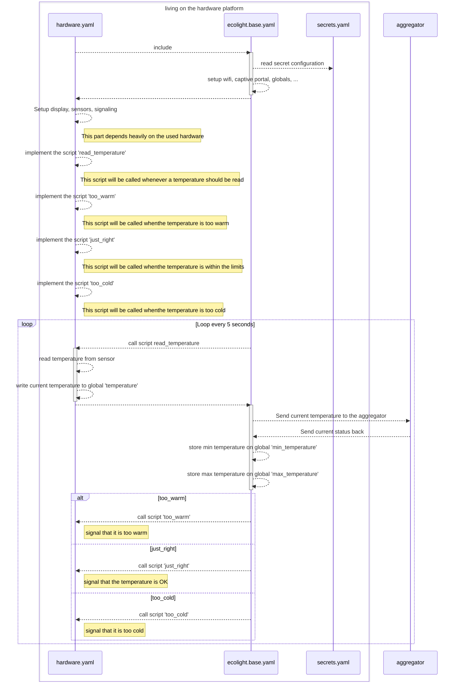

# hardware

Welcome to the hardware section. This part of the repository holds the hardware configuration and firmware files which can be built with esphome.io. There is a build process which ensures that the checked in version of the hardware is currently working (or not). You can see the details in the [hardware workflow](https://github.com/bytebang/ecolight/actions/workflows/hardware.yml) of the repository.

However - we try to build the system as flexible as possible, and we try to have it portable to as many esp systems as popssible. Therefore we are using a clever mechanism which separates the configuration of the boards of the functionality needed for the system.
The core functionality is available in the `ecolight.yaml` file, and the hardware specific part in the files which are named like the hardare platform.

## hardware specific documentation

To keep our repository clean we keep the documentation in folders which are named exactly as the yaml file for the platform.

## base functionality

In order to make the whole system work, we have defined some common / core functionality which has to be provided by every platform which wants to participate. This logis is stored in the [ecolight.base.yaml](./ecolight.base.yaml) file, which has to be included in the more specific hardware files. (Talking in programmer terms: The ecolight.base.yaml acts as a kind of abstract base class where specific clients can be created with ver little effort). 

However - the hardware has no magic to implement, because the target temperatures and so on are stored on the aggregator. One could also say, that the hardware can be relatively dumb, and just used as a 'display, and measurement device' for a single room. 

The flow is always the same: The hardware is the one which establishes contact with the aggergator, sends the current temperature and the aggregator decides what should be signaled on the hardware. 

Lets assume that the `hardware.yaml` includes the `ecolight.base.yaml`, and that a valid aggregator url has been specified in the `secrets.yaml` - then the workflow would look like this:

