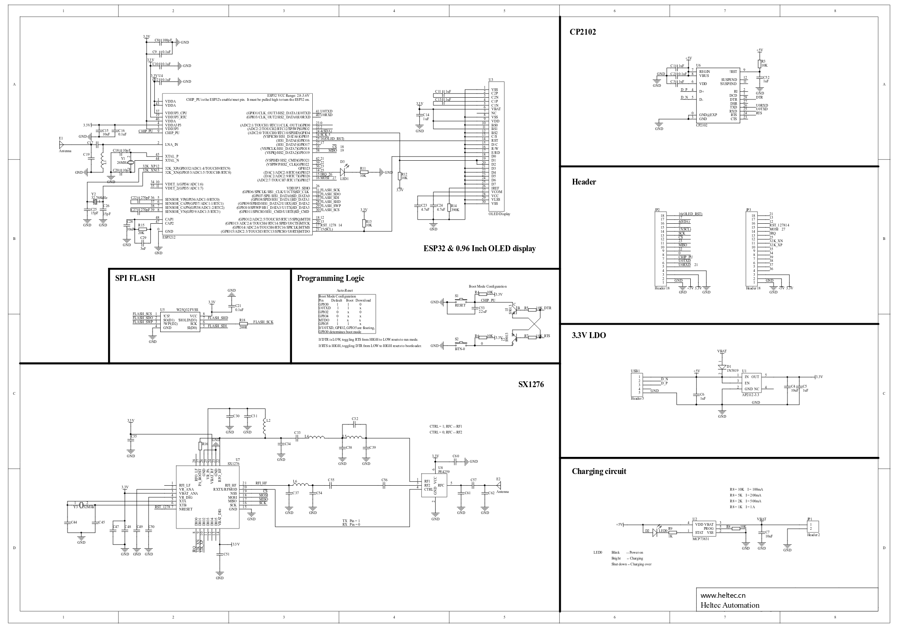

# Description

* ESP32 with 2.4 GHz WiFi, BT, Dual Core, 240MHz clock frequency, and 4MB Flash memory
* Data rates: 150 Mbps @ 11n HT40, 72 Mbps @ 11n HT20, 54 Mbps @ 11g, 11 Mbps @ 11b
    * Transmit power: 19.5 dBm at 11b, 16.5 dBm at 11g, 15.5 dBm at 11n
    * Receiver sensitivity up to -98 dBm
    * UDP throughput of 135 Mbps

* LoRa Modem, based on the SX1276 chip, (868-915 MHz, RX: -148 dBm, TX: +20 dBm). An antenna must be connected, as poor SWR can damage the chip.
* 128x64 Pixel blue OLED display
* CP2102 USB → Serial converter
* Charging & discharging circuit for lithium batteries. When the battery is full, the blue LED stops working. Ensure correct polarity when using the battery to prevent damage.

# Additional Information

You can find a detailed guide on how to flash LuaRTOS to the board, along with hardware information, [here](https://www.bytebang.at/Blog/Porting+LuaRTOS+to+the+TTGO+LoRa32+Board).

Key | Value
-------- | --------
Operating Voltage | 3.3V to 7V (best supplied via USB)
Operating Temperature Range | -40°C to +90°C
Enclosure (3D Printing) | [Thingiverse Link](https://www.thingiverse.com/thing:3443245)
Cost | ~€15.00 / piece
Source | [Banggood Link](https://de.banggood.com/2Pcs-LILYGO-TTGO-LORA32-915Mhz-ESP32-LoRa-OLED-0_96-Inch-Blue-Display-p-1239769.html)

# Schematic

